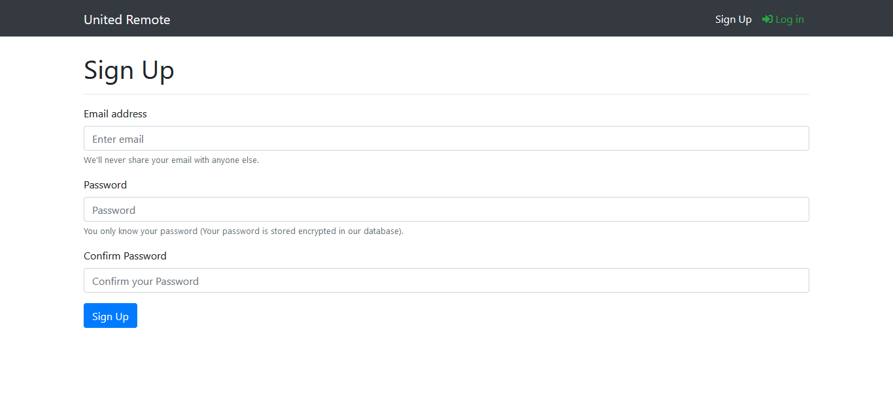
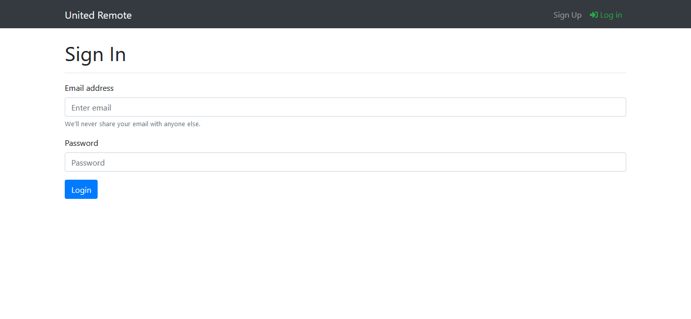
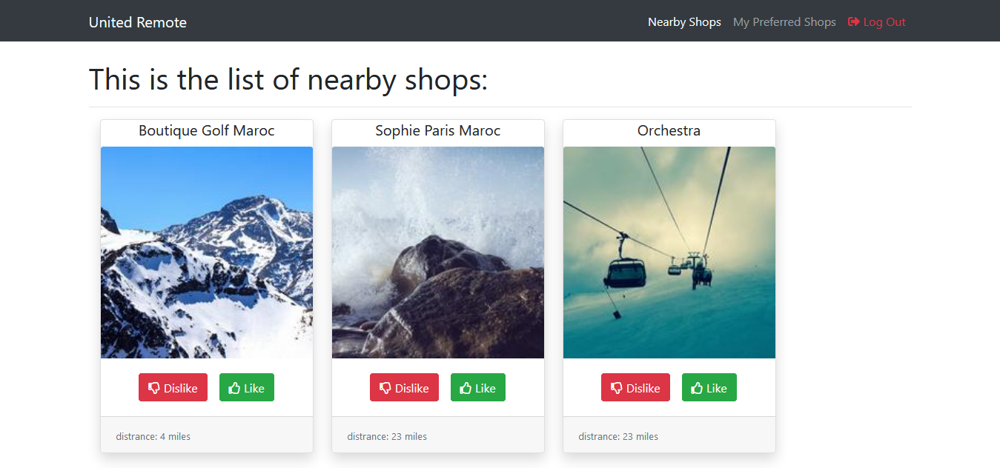
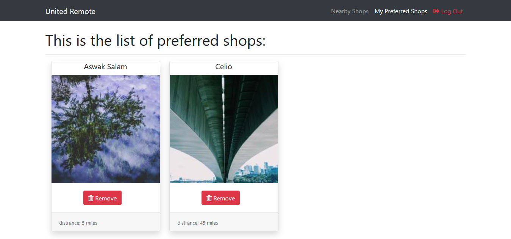

## Udacity cloud developper Capstone project

An application that lists shops nearby and display the preferred shops list based in user preference, built with React, Redux, NodeJS, Express, Html and CSS

## Features

* As a User, I can sign up using my email & password
* As a User, I can sign in using my email & password
* As a User, I can display the list of shops sorted by distance
* As a User, I can like a shop, so it can be added to my preferred shops
    * Acceptance criteria: liked shops are not displayed on the nearby shops page
* As a User, I can dislike a shop, so it won’t be displayed within “Nearby Shops” list during the next 2 hours
    * It won't be displayed only in the UI, refreshing the page will bring it back
* As a User, I can display the list of preferred shops
* As a User, I can remove a shop from my preferred shops list

## Project Screenshots

### Sign Up page

### Sign In page

### Nearby Shops pag

### Preferred Shops Page

## Installation 

### Prerequisites

You need to [Download & Install Node.js](https://www.guru99.com/download-install-node-js.html).
Also an active internet connection is required to import CDNs.

###  Setup Instructions

You can find instructions for the front-end and back-end setup in their respectives folders.

## Authors

* **Tondi Ismael** - *Initial work* - [smiletondi](https://twitter.com/smiletondi)

## Acknowledgments

* [Lorem Picsum](https://picsum.photos/)  The Lorem Ipsum for photos.