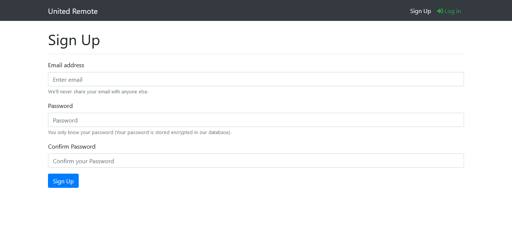
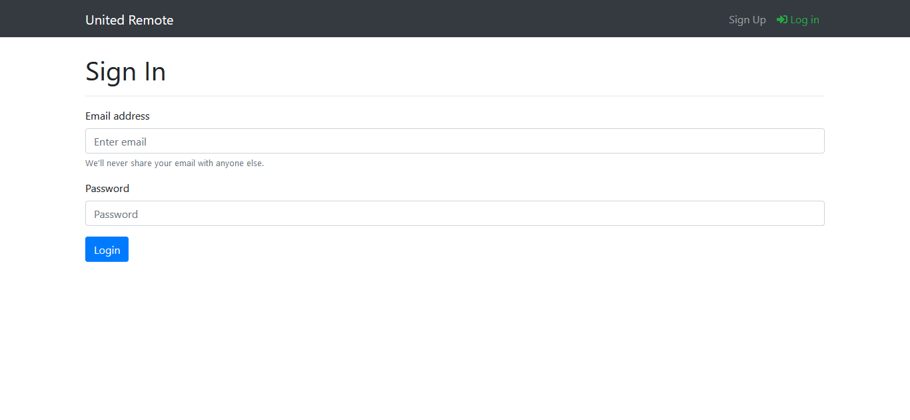
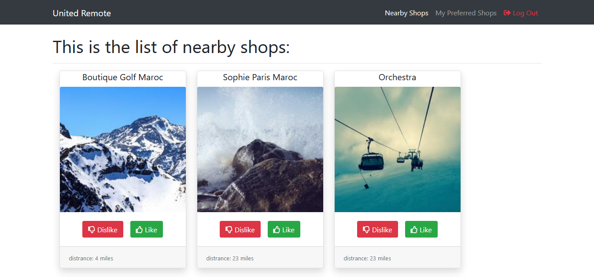
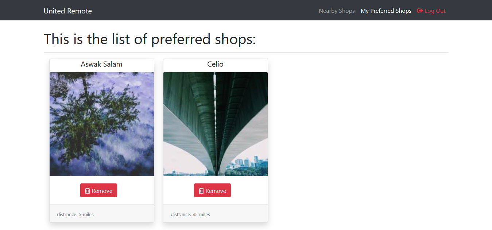

An application that lists shops nearby and display the preferred shops list based in user preference, built with React, Redux, Bootstrap, NodeJS and Express. Try a working demo [here](https://smiletondi.github.io/HF_frontEnd/)

## Features

* As a User, I can sign up using my email & password
* As a User, I can sign in using my email & password
* As a User, I can display the list of shops sorted by distance
* As a User, I can like a shop, so it can be added to my preferred shops
    * Acceptance criteria: liked shops are not displayed on the nearby shops page
* As a User, I can dislike a shop, so it won’t be displayed within “Nearby Shops” list during the next 2 hours
    * It won't be displayed only in the UI, refreshing the page will bring it back
* As a User, I can display the list of preferred shops
* As a User, I can remove a shop from my preferred shops list

## Project Screenshots

### Sign Up page

### Sign In page

### Nearby Shops pag

### Preferred Shops Page

## Installation 
To work you need to couple this with [Back-End](https://github.com/smiletondi/HF_backEnd)

### Prerequisites

You need to [Download & Install Node.js](https://www.guru99.com/download-install-node-js.html).
Also an active internet connection is required to import CDNs.

###  Setup Instructions

Clone down this repository or download it.
Open up your terminal and type the following commands:

Installation:

`npm install`  

To Start the Servers:

`npm start`  

To Visit the App:

`localhost:3000`  

## Reflection

This was a project built during my application at United Remote. Project goals included using technologies i wanted and familiarizing myself with documentation for new features.  

I started the building process by using the `create-react-app` boilerplate, then adding the `Bootstrap` framework to not focus my efforts on `CSS`.  

Due to the absence of time constraints, I had to meticulously choose the technologies and test them before implementation in the project.

## Built With

* [React](https://reactjs.org/)
* [Redux](https://redux.js.org/)
* [Bootstrap](https://getbootstrap.com/)
* [axios](https://github.com/axios/axios)
* [react-dom](https://reactjs.org/docs/react-dom.html)
* [react-redux](https://redux.js.org/basics/usage-with-react)
* [react-router-dom](https://www.npmjs.com/package/react-router-dom)
* [redux-thunk](https://github.com/reduxjs/redux-thunk)

## Authors

* **Tondi Ismael** - *Initial work* - [smiletondi](https://github.com/smiletondi)

## Acknowledgments

* [Lorem Picsum](https://picsum.photos/)  The Lorem Ipsum for photos.
